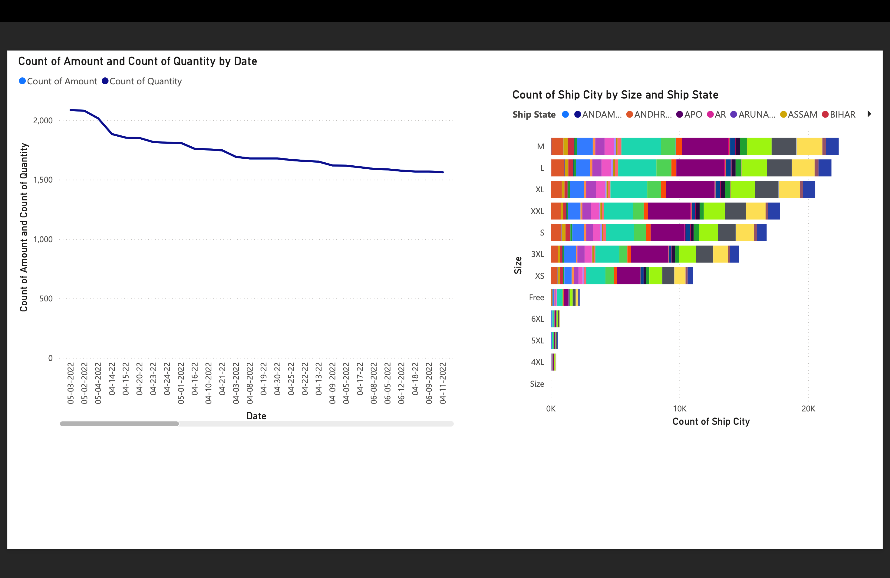

# Amazon Sales Dashboard



## 📌 Project Overview
The **Amazon Sales Dashboard** is a web-based data visualization application built using Flask and Power BI. It provides insights into Amazon sales trends through interactive reports, charts, and downloadable datasets. The project includes:
- **Interactive Power BI Reports**
- **Monthly Sales Trends & Category-wise Analysis**
- **Downloadable PDF and PBIX Reports**
- **Dataset Preview & Download Option**

## 🚀 Features
✅ **Dynamic Sales Analysis:** Visualizations of monthly trends and category sales using Matplotlib and Seaborn.  
✅ **Power BI Integration:** Embed and download Power BI reports (PBIX & PDF).  
✅ **Flask Backend:** Serves the dashboard and manages report downloads.  
✅ **Bootstrap UI:** A clean and responsive interface.  
✅ **Dataset Accessibility:** Preview and download dataset images.  

---

## 📂 Project Structure
```
Amazon_Sales_Dashboard/
│── static/
│   ├── images/               # Report images & dataset preview
│   ├── reports/              # PDF & PBIX files
│── templates/
│   ├── index.html            # Main dashboard UI
│── datasets/
│   ├── amazon_sales_data.csv # Sales dataset
│── Python/
│   ├── visualization.py      # Data visualization functions
│── app.py                    # Flask application
│── requirements.txt          # Dependencies
│── README.md                 # Project Documentation
```

---

## 🛠️ Installation & Setup
### **1️⃣ Clone the Repository**
```sh
git clone https://github.com/HarshLahane78/Amazon_Sales_Dashboard.git
cd Amazon_Sales_Dashboard
```

### **2️⃣ Create Virtual Environment & Install Dependencies**
```sh
python -m venv venv
source venv/bin/activate  # For Mac/Linux
venv\Scripts\activate     # For Windows
pip install -r requirements.txt
```

### **3️⃣ Run the Flask App**
```sh
python app.py
```
**Access the dashboard at:** `http://127.0.0.1:5000/`

---

## 📊 Dashboard UI
### **🔹 Power BI Report Section**
- View and toggle **Power BI reports**.
- Download the **PDF and PBIX files**.

### **🔹 Sales Insights**
- **Sales Trends:** Monthly sales analysis with line graphs.
- **Category Analysis:** Bar charts for sales by category.
- **Interactive Charts:** Plotly-powered visualizations.

### **🔹 Dataset & Downloads**
- **Preview dataset** with sample images.
- **Download raw CSV file**.

---

## 🌐 Deployment Guide
This project can be deployed using:
- **GitHub Pages** (For hosting static files)
- **Render / Railway / Heroku** (For Flask backend)

### **Deploy on Render (Recommended)**
1. Create an account on [Render](https://render.com/).
2. Click **New Web Service** → Connect GitHub repo.
3. Choose runtime **Python 3.x**.
4. Set **Start Command**: `gunicorn app:app`.
5. Click **Deploy** & get live URL! 🚀

---

## 📝 To-Do List (Future Enhancements)
- [ ] **Improve UI with Tailwind CSS**
- [ ] **Add more visualizations & filtering options**
- [ ] **Host on a cloud platform (AWS/GCP)**
- [ ] **Embed live Power BI report (if possible)**

---

## 🤝 Contributing
Contributions are welcome! Feel free to open issues and submit pull requests.

---

## 📜 License
This project is licensed under the **MIT License**.

---

## 📬 Contact
📧 Email: [harshwardhanlahane633@gmail.com](mailto:harshwardhanlahane633@gmail.com)  
🔗 GitHub: [HarshLahane78](https://github.com/HarshLahane78)

